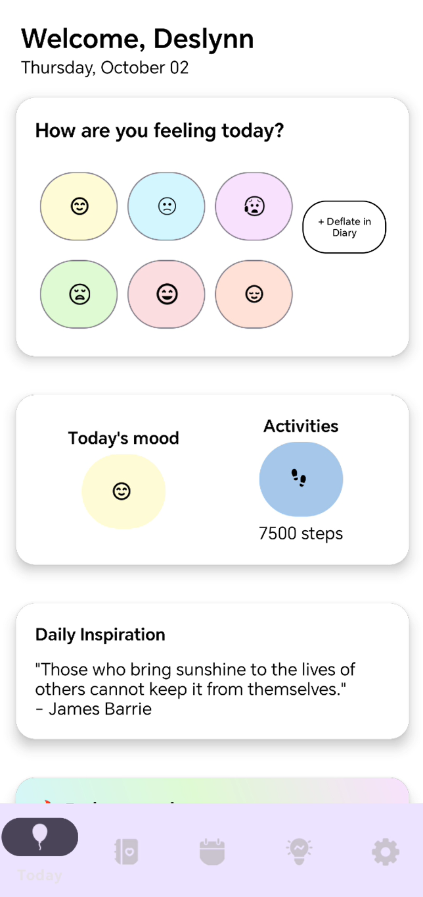

# Deflate - Personal Wellness & Activity Tracker

**Deflate** is an Android application designed to help users track their daily activities, mood, and wellness journey. The app provides a holistic approach to personal health management with features for activity tracking, mood monitoring, diary entries, and inspirational quotes.

## Overview

  
   
  
  

## 📱 Features

### 🔐 Authentication
- **Multiple Sign-in Options**: Email/Password, Google, Facebook, and GitHub OAuth
- **User Registration**: Create accounts with username and email
- **Secure Authentication**: Powered by Firebase Authentication
- **Session Management**: Persistent login sessions

### 🏠 Home Dashboard
- **Mood Tracking**: Select from 6 different moods (Happy, Sad, Anxious, Tired, Excited, Content)
- **Daily Quotes**: Personalized inspirational quotes based on your current mood
- **Date Display**: Current date with beautiful formatting
- **Quick Navigation**: Easy access to all app features

### 📊 Activity Tracking
- **Weight Monitoring**: Track your weight with automatic data persistence
- **Step Counting**: Log daily step counts
- **Data History**: View your latest recorded values
- **Cloud Storage**: All data synced with Firebase Firestore

### 📖 Personal Diary
- **Daily Entries**: Write and save personal thoughts
- **Mood Integration**: Link diary entries with your daily mood
- **Privacy**: Secure storage of personal reflections

### 📅 Calendar & Insights
- **Calendar View**: Visual representation of your wellness journey
- **Data Insights**: Analytics and trends from your tracked activities
- **Historical Data**: Review past entries and progress

### ⚙️ Settings & Profile
- **User Profile Management**: Update personal information
- **App Preferences**: Customize your experience
- **Account Management**: Sign out and account settings

## 🛠️ Technical Stack

### Core Technologies
- **Language**: Kotlin
- **Platform**: Android (API 24+)
- **Architecture**: MVVM with Activities
- **Build System**: Gradle with Kotlin DSL

  ### External APIs
- **FavQs API**: For inspirational quotes based on mood
- **GitHub OAuth**: For GitHub sign-in integration

1. **Installation**
- Within the repository, click on the "<> Code" drop down on the far right next to the "Go to file" and "+" buttons.
- On the Local tab, click on the last option: "Download ZIP".
- Once the zip file has downloaded, open your local file explorer.
- Go to your Downloads.
- Click on the "Deslynn_ST10251981_PROG7314_Part2.zip" folder, should be most recent in Downloads.
- Extract the files and store the project in the location of choice.
- Navigate to Android Studio.
- To open the project, click File > Open > Choose the project.
- 

2. **Firebase Setup**
   - Create a new Firebase project at [Firebase Console](https://console.firebase.google.com/)
   - Download `google-services.json` and place it in the `app/` directory
   - Enable Authentication and Firestore in Firebase Console

3. **Configure OAuth Providers**
   - **Google**: Add your app's SHA-1 fingerprint to Firebase Console
   - **Facebook**: Update `facebook_app_id` and `facebook_client_token` in `strings.xml`
   - **GitHub**: Update `GITHUB_CLIENT_ID` in `SignInActivity.kt`

4. **Build and Run**
   -  To run the application, click on the play button.

   ## 🔐 Security Features

- **Firebase Authentication**: Secure user management
- **Data Encryption**: All data encrypted in transit and at rest
- **Input Validation**: Comprehensive input sanitization
- **OAuth Integration**: Secure third-party authentication

## 🌟 Key Features in Detail

### Mood-Based Quote System
The app intelligently selects inspirational quotes based on your current mood:
- **Happy**: Joy, positivity, life quotes
- **Sad**: Motivation, hope, strength quotes
- **Anxious**: Wisdom, peace, calm quotes
- **Tired**: Energy, perseverance, success quotes
- **Excited**: Inspiration, enthusiasm, adventure quotes
- **Content**: Peace, gratitude, harmony quotes

### Real-time Data Sync
- All user data automatically synced with Firebase Firestore
- Offline support with local caching
- Real-time updates across devices

## 📺 Youtube
- link: https://www.youtube.com/watch?v=8cBRrMAoGz0 
